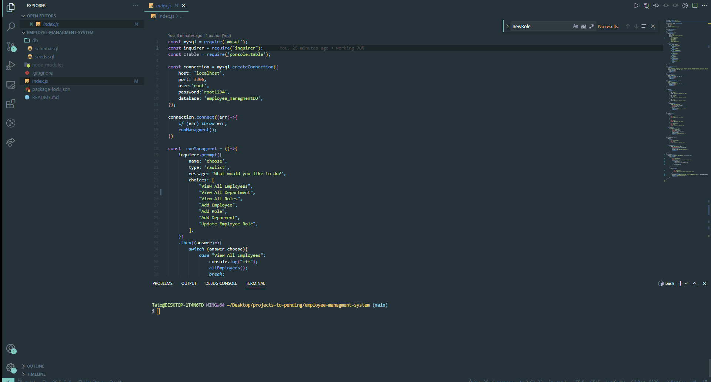

## employee-managment-system

<!-- PROJECT LOGO -->
 

 
  <h3 align="center">Employee Managment System</h3>
n
  

    An awesome app to search your Mysql database and view it in your terminal
  

<!-- TABLE OF CONTENTS -->

  
Table of Contents

  <ol>
    <li>
      <a href="#about-the-project">About The Project</a>
      <ul>
        <li><a href="#built-with">Built With</a></li>
      </ul>
    </li>
    <li><a href="#installation">Installation</a></li>
    <li><a href="#usage">Usage</a></li>
    <li><a href="#licens">Licens</a></li>
    <li><a href="#credits">Credits</a></li>
  </ol>

<!-- ABOUT THE PROJECT -->

## About The Project

Employee Managment app is used to add departments, roles, and employees for a businessm and store all the data inside Mysql database. User can view everything by using the terminal.

### Built With

- [JavaScript](https://www.javascript.com/)
- [MySQL](https://dev.mysql.com/)
- [Inquirer](https://www.npmjs.com/package/inquirer)
- [NPM](https://www.npmjs.com/)
- [Console.table](https://www.npmjs.com/package/console.table)

## Installation

Clone the application
Run `npm install` to install the dependencies
Run `npm install console.table`

## Usage

When type node index.js to run the app you are going to get many options to choose from you can view all employees all department and roles you can also add and update employee role

## License

This project is licensed under the terms of the [MIT](https://opensource.org/licenses/MIT) license.

## Credits

1. https://www.w3schools.com/
2. https://stackoverflow.com/
3. https://github.com/
4. https://docs.npmjs.com/
